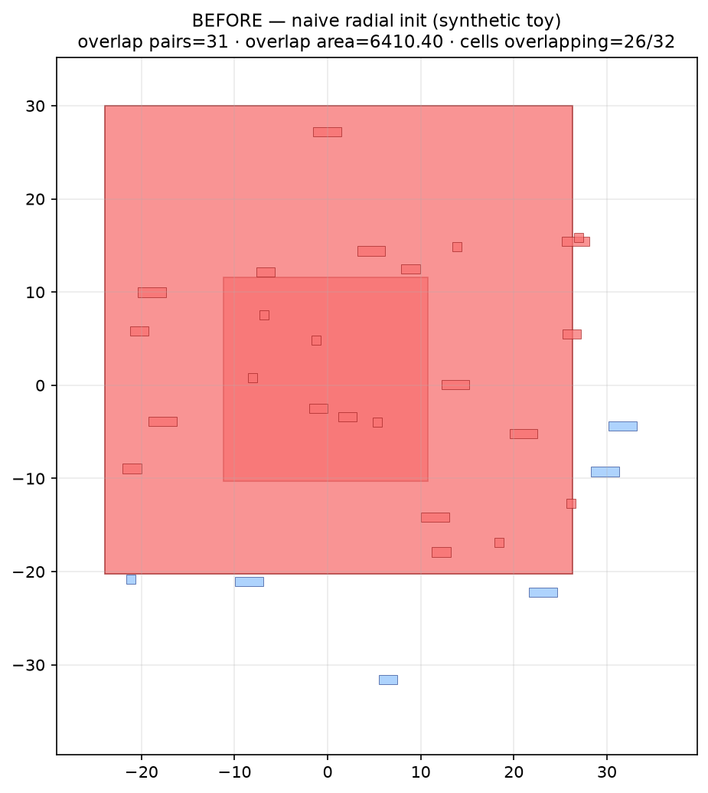
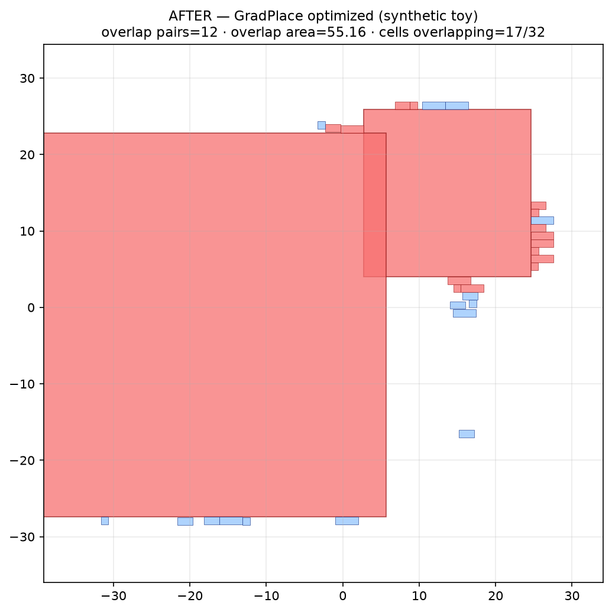
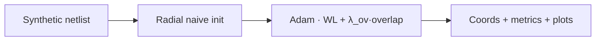
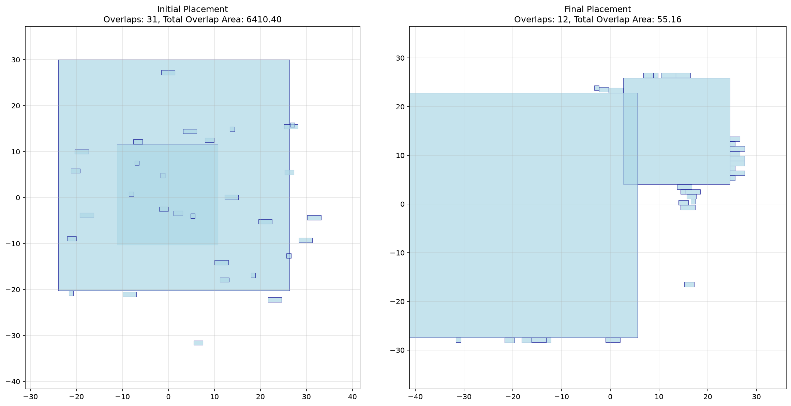

[](https://github.com/ArchanaChetan07/GradPlace/actions/workflows/ci.yml)

PyTorch analytical chip placer — macro-aware density modeling with two-phase overlap optimization (`λ_overlap` 0.1 → 15.0).

**8.82% wirelength cut · 99.14% overlap-area eliminated vs naive radial init on synthetic toy (2 macros + 30 std cells, seed 1003) · 6/6 tests · CI: green**

`docker compose up --build` → writes before/after plots + metrics into `assets/`.

| BEFORE (naive radial init) | AFTER (GradPlace, 2000 epochs, CPU) |
|---|---|
|  |  |

Red cells = involved in ≥1 pairwise overlap. Purple = macros. Blue = standard cells.

**Repo:** [github.com/ArchanaChetan07/GradPlace](https://github.com/ArchanaChetan07/GradPlace)

---

## Overview

GradPlace is a **differentiable VLSI placement** loop in PyTorch: generate a random macro/std-cell netlist, scatter cells (naive baseline), then Adam-optimize `(x, y)` to trade off **smooth Manhattan wirelength** against **density/overlap repulsion**.

The default demo benchmark is a **synthetic toy netlist** (`2` macros + `30` standard cells, seed `1003`) — **not** an ISPD/contest industry case. Framing it as such keeps the metrics honest.

Entry points:
- `python scripts/eval_before_after.py` — before/after metrics + plots (source of README numbers)
- `python test.py --quick` — multi-size synthetic suite
- `python main.py --quick` — thin wrapper (CPU by default)

---

## Method (plain language)

| Knob | Value | What it does |
|---|---|---|
| `macro_weight` | **5.0** | Macros count 5× in the density map so big blocks don’t get buried by tiny cells |
| Std-cell bin cap | **0.25 × bin_capacity** | Limits how much density a single std-cell can dump into one bin |
| `λ_overlap` ramp | **0.1 → 1.0 → 15.0** | Phase 1 (first 40% of epochs) slowly turns up overlap pressure; phase 2 finishes at 15 |
| Wirelength | Smooth Manhattan (`α=0.1`) | Differentiable routing-cost proxy between connected pins |
| Optimizer | Adam, `lr=0.01` | Updates cell centers only |



---

## Results (verified this session)

Command: `python scripts/eval_before_after.py --epochs 2000 --device cpu`  
Artifact: [`assets/benchmark_metrics.json`](assets/benchmark_metrics.json)  
Hardware: **CPU** · PyTorch `2.2.2+cpu` · Windows host (`platform` recorded in JSON)

| Metric | BEFORE | AFTER | Δ |
|---|---:|---:|---:|
| Smooth Manhattan wirelength | **15,540.73** | **14,170.22** | **−8.82%** |
| Total overlap area | **6,410.40** | **55.16** | **−99.14%** |
| Overlap pairs | 31 | 12 | −19 |
| Cells with ≥1 overlap | 26 / 32 | 17 / 32 | — |
| Runtime | — | **2.874 s** | — |

Side-by-side: 

Residual overlaps after 2000 epochs are expected on this tiny, densely interconnected toy — the optimizer prioritizes clearing bulk overlap area while keeping nets short.

---

## How to Run

```bash
git clone https://github.com/ArchanaChetan07/GradPlace.git
cd GradPlace
python -m venv .venv
# Windows: .\.venv\Scripts\Activate.ps1
source .venv/bin/activate
pip install torch --index-url https://download.pytorch.org/whl/cpu
pip install -r requirements.txt

python scripts/eval_before_after.py --epochs 2000 --outdir assets --device cpu
```

Docker:

```bash
docker compose up --build
# plots + assets/benchmark_metrics.json refreshed in ./assets
```

CUDA optional: `--device cuda` when a GPU is available; CI and Docker default to **CPU**.

---

## Tests

```bash
pytest tests/ -v --tb=short
```

Verified this session: **6/6 passed** — bin-cap constant, λ ramp schedule, monotonicity, CPU placer smoke on the synthetic toy, and metrics JSON schema.

---

## Tech Stack

| Layer | Technology |
|---|---|
| Placer | PyTorch (`placement.py`) |
| Viz | matplotlib |
| Eval | `scripts/eval_before_after.py` |
| Containers | Dockerfile · Compose |
| CI | GitHub Actions (CPU torch + pytest + Docker build) |

---

## License

See repository.

## Author

**Archana Chetan** · [@ArchanaChetan07](https://github.com/ArchanaChetan07)
