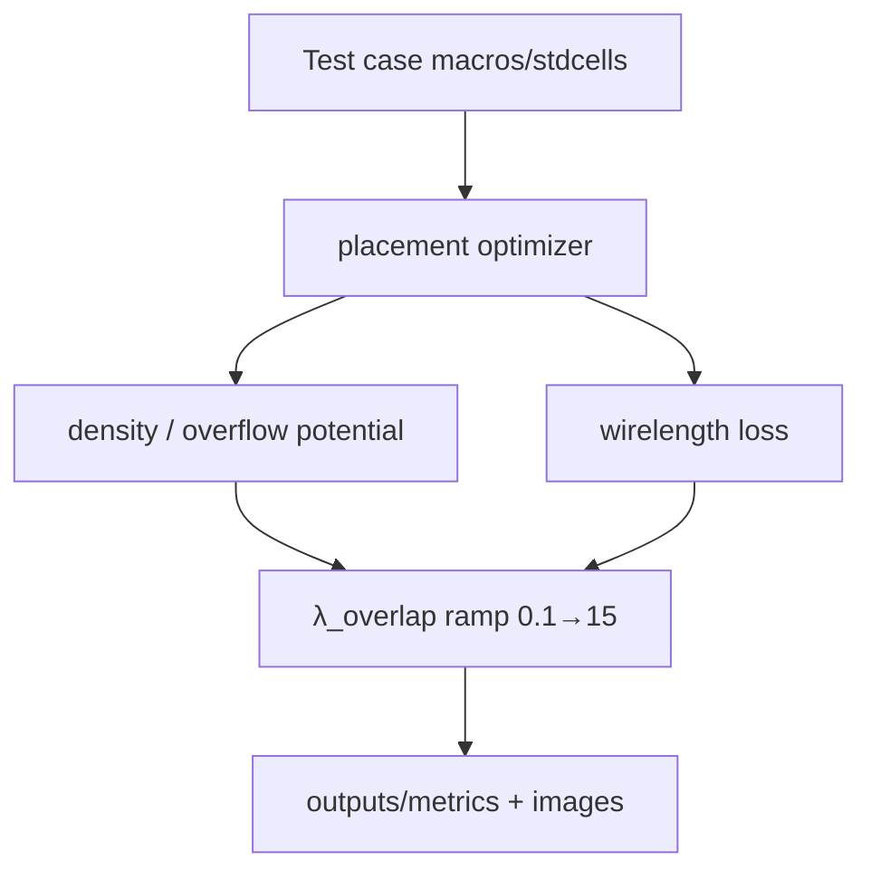
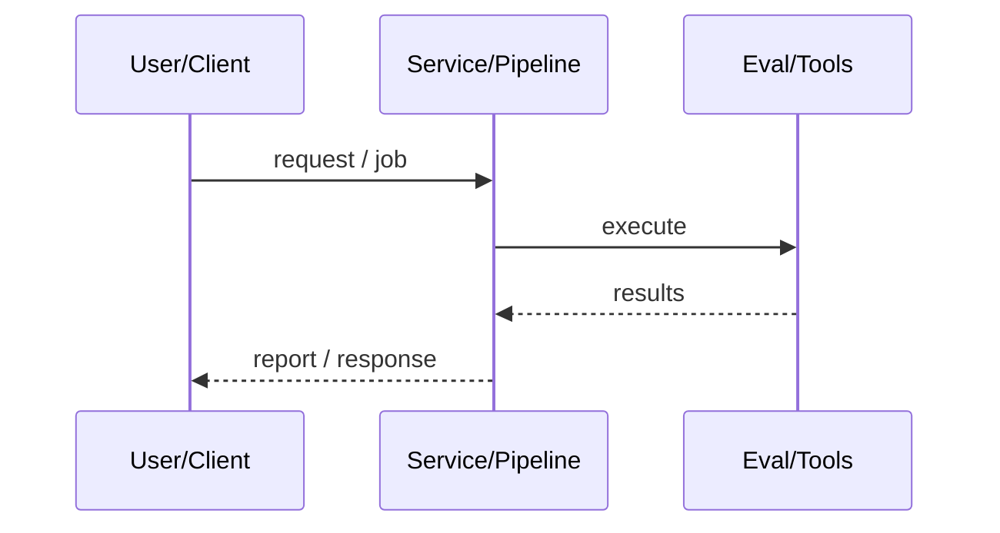
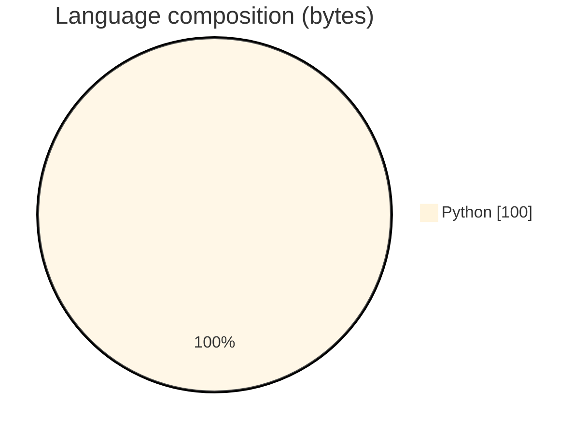

# GradPlace — Differentiable VLSI Cell Placement

### PyTorch analytical placer with macro-aware density, bin capacity caps, and two-phase λ_overlap ramp for overlap/wirelength optimization.

[](https://github.com/ArchanaChetan07/GradPlace)
[](https://github.com/ArchanaChetan07/GradPlace)
[](https://github.com/ArchanaChetan07/GradPlace)
[](https://github.com/ArchanaChetan07/GradPlace/actions)

---

## Overview

Global placement must spread macros/stdcells while minimizing wirelength and residual overlaps using GPU-friendly gradients.

Large placement.py implements density/overflow potentials with macro_weight=5.0, stdcell bin cap 0.25×bin_capacity, and λ_overlap smooth ramp 0.1→1.0 then →15.0; test harnesses and timestamped output metrics/images.

Runnable placement challenge entrypoint printing average overlap, wirelength, and runtime across predefined test cases.

This repository is maintained as **production-minded portfolio work**: clear architecture, automated checks where present, and metrics that are **traceable to committed artifacts** (never invented).

---

## Architecture

Netlist/test case → initialize cell coords → optimize wirelength+overlap losses with λ schedule → metrics/images under outputs/





---

## Results & repository facts

> Only values found in code, configs, tests, or generated reports are listed. Absence of a clinical/ML accuracy number means it was **not** published in-repo.

| Metric | Value | Source |
|---|---|---|
| macro_weight | **5.0** | `placement.py` |
| Standard-cell bin capacity cap | **0.25 × bin_capacity** | `placement.py` |
| λ_overlap ramp range | **0.1 → 15.0 (two-phase)** | `placement.py` |
| Tracked blobs on main | **15** | `git tree main` |
| Tracked files | **15** | `git tree` |
| Python modules | **5** | `git tree` |
| Test-related paths | **1** | `git tree` |
| CI workflows | **Yes** | `.github/workflows` |
| Docker present | **No** | `repo root` |



---

## Key features

- Macro-weighted density potential
- Standard-cell bin capacity capping
- Two-phase λ_overlap force ramp
- Debug image dumps (snapshots, heatmaps, loss curves)
- Quick vs full test suites
- CUDA optional

---

## Tech stack

| Layer | Technology |
|---|---|
| language | Python |
| dl | PyTorch |
| domain | VLSI placement |
| tooling | debug visualizations / JSON metrics |

---

## Skills demonstrated

Python · PyTorch · CI/CD · testing · automation

Keyword surface: **Python · Python · machine-learning · CI/CD · testing · API · Docker · automation · data-science · software-engineering · system-design · observability · LLM · cloud**

---

## Project structure

```text
GradPlace/
├── placement.py
├── main.py / src/main.py
├── test.py
├── check_cuda.py
├── outputs/README.md
└── .github/workflows/ci.yml
```

---

## Installation & usage

```bash
git clone https://github.com/ArchanaChetan07/GradPlace.git
cd GradPlace
pip install -r requirements.txt
python main.py --quick --device cpu
```

---

## How it works

Cells are optimized with differentiable density/overflow and wirelength objectives; macros are upweighted in density, stdcells are capacity-capped per bin, and overlap penalty strength ramps across training phases before emitting metrics.

---

## Future improvements

- Commit example outputs/run_* metrics JSONs
- Expand README beyond template spam using outputs/README content
- Public leaderboard numbers if contest scores exist

---

## License

See repository.

---

<p align="center">
  <b>GradPlace — Differentiable VLSI Cell Placement</b><br/>
  <a href="https://github.com/ArchanaChetan07/GradPlace">github.com/ArchanaChetan07/GradPlace</a>
</p>
