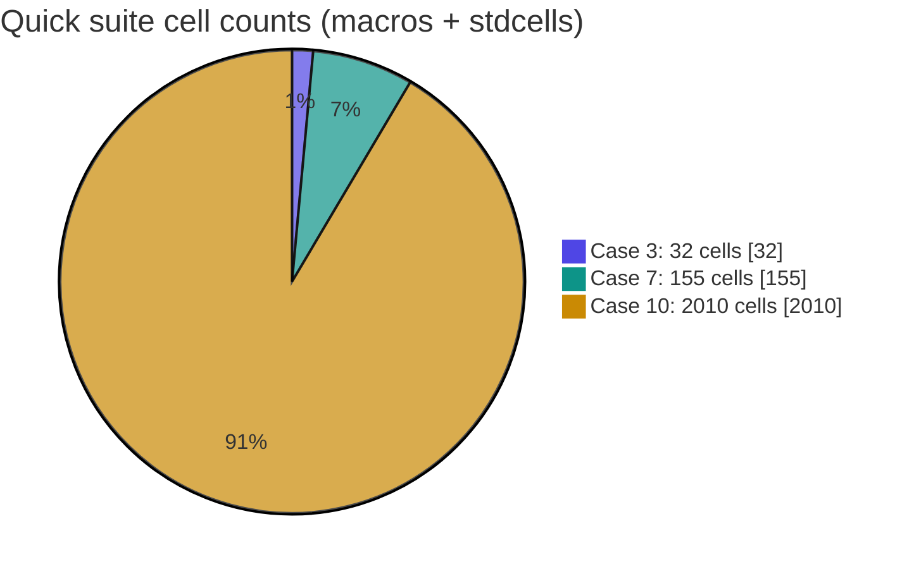
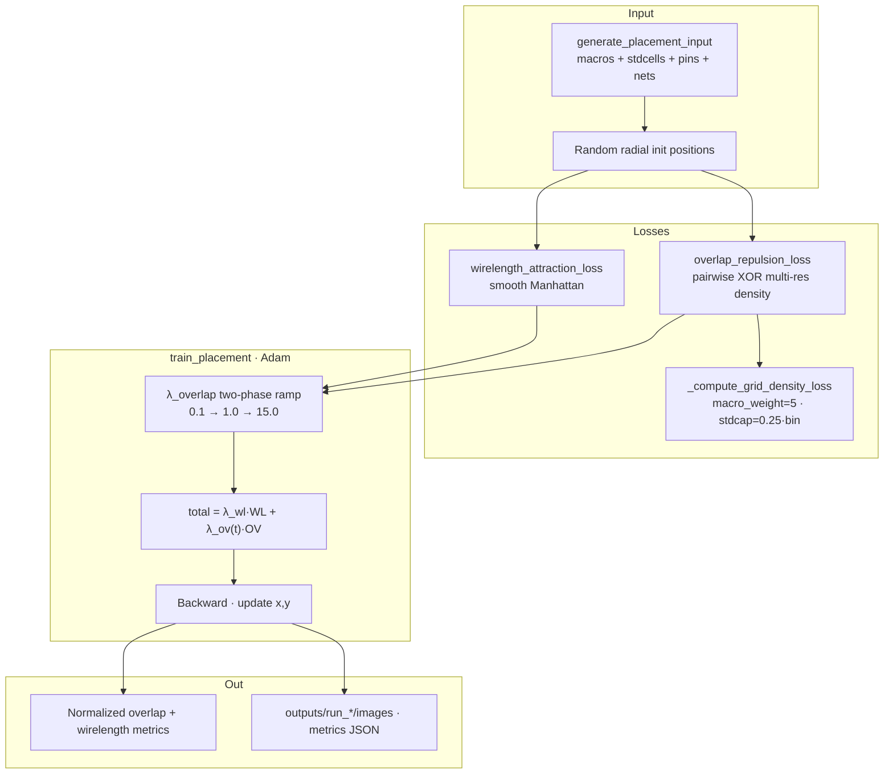
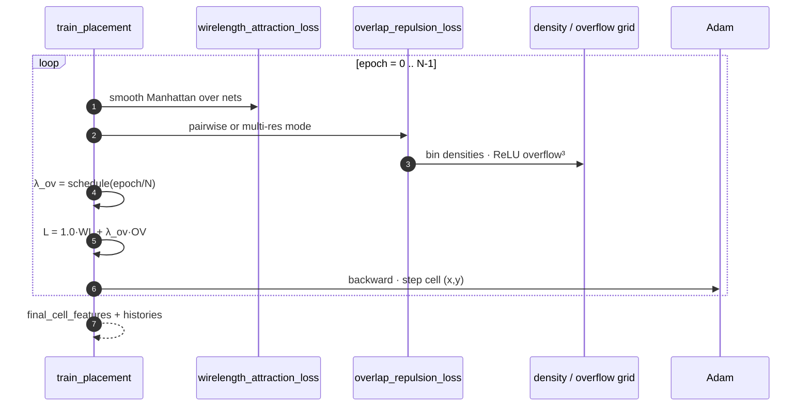
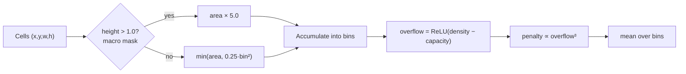
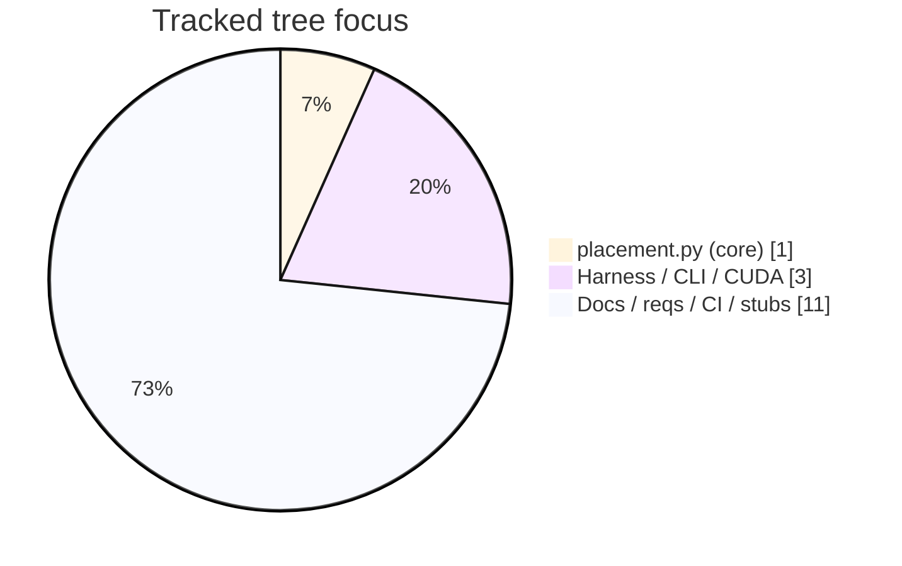

# GradPlace — Differentiable VLSI Cell Placement

### PyTorch analytical placer with macro-aware density, std-cell bin caps, and a two-phase λ_overlap schedule

[](https://github.com/ArchanaChetan07/GradPlace/actions/workflows/ci.yml)
[](https://www.python.org/)
[](placement.py)
[](#)
[](check_cuda.py)
[](https://github.com/ArchanaChetan07/GradPlace)

> Optimize cell coordinates with **GPU-friendly gradients** so total **wirelength** drops while **overlaps** are driven toward zero — including **macro up-weighting**, **standard-cell bin capacity caps**, and a **scheduled λ_overlap** ramp (`0.1 → 1.0 → 15.0`).

**Repo:** [github.com/ArchanaChetan07/GradPlace](https://github.com/ArchanaChetan07/GradPlace)

---

## Verified constants (from `placement.py` / `test.py`)

| Parameter | Value | Source |
|---|---|---|
| Macro density weight | **`macro_weight = 5.0`** | `_compute_grid_density_loss` |
| Std-cell bin capacity cap | **`0.25 × bin_capacity`** | same |
| Overflow penalty | **cubic** `overflow ** 3` (clamped) | same |
| λ_overlap schedule | **Phase 1 (0–40%):** `0.1 → 1.0` · **Phase 2 (40–100%):** `1.0 → 15.0` (clamped ≤ 15) | `train_placement` |
| Default λ_wirelength | **1.0** | `train_placement` kwargs |
| Default epochs / lr | **1000** / **0.01** (Adam) | `train_placement` |
| Wirelength model | Smooth Manhattan (`alpha = 0.1`) | `wirelength_attraction_loss` |
| Macro area range | **100 – 10,000** | `MIN/MAX_MACRO_AREA` |
| Std-cell areas | **{1, 2, 3}** · height **1.0** | constants |
| Pin size | **0.1 × 0.1** | `generate_placement_input` |
| Full suite designs | **12** cases · macros **2–10** · stdcells **20 – 100,000** | `TEST_CASES` |
| Quick suite | **3** cases · (2×30), (5×150), (10×2000) | `QUICK_TEST_CASES` |
| Tracked files on `main` | **15** | git tree |
| Success criteria (challenge) | `overlap_count → 0`, `total_overlap_area → 0.0`, minimize wirelength | file header |

```mermaid
xychart-beta
    title λ_overlap schedule breakpoints (fraction of training)
    x-axis [start_0pct, phase1_end_40pct, end_100pct]
    y-axis "λ_overlap" 0 --> 16
    line [0.1, 1.0, 15.0]
```



---

## Problem

Global VLSI placement must:

1. **Spread** macros and standard cells across the canvas  
2. **Minimize** routing cost (wirelength between connected pins)  
3. **Drive residual overlaps to zero** with differentiable forces that run on CPU or CUDA  

GradPlace implements that loop as an **analytical / force-directed** PyTorch program with contest-style metrics and debug visualizations.

---

## Architecture



### Optimization step



### Density / overflow path



---

## Loss design (code-faithful)

### Wirelength
- Pin-aware edges from `edge_list`  
- **Smooth Manhattan** distance with `alpha = 0.1`  
- Normalized by number of edges  

### Overlap / density
| Mode | Behavior |
|---|---|
| Default | Pairwise 2D AABB overlap areas (ReLU separations) |
| `multi_res=True` | Fine + coarse **grid density overflow** (coarser bin = `2× bin_size`) |
| Optional `blur` | Light conv smoothing on overflow |

### Combined objective

\[
L(t) = \lambda_{\mathrm{wl}}\,L_{\mathrm{wire}} + \lambda_{\mathrm{ov}}(t)\,L_{\mathrm{overlap}}
\]

with \(\lambda_{\mathrm{wl}}=1.0\) and \(\lambda_{\mathrm{ov}}(t)\) ramping **0.1 → 1.0** (first 40% of epochs) then **1.0 → 15.0**.

---

## Evaluation harness

Reported by `main.py` / `test.py`:

| Metric | Definition |
|---|---|
| Average Overlap | cells-with-overlaps / total cells (suite mean) |
| Average Wirelength | normalized: `(Σ wirelength / #nets) / √(total area)` |
| Total Runtime | wall seconds for the selected suite |

```bash
# Quick: 3 designs
python main.py --quick --device cpu

# Full: 12 designs up to 10 macros + 100k stdcells
python main.py --full --device cpu

# CUDA when available
python main.py --quick --device cuda
python check_cuda.py
```

| Suite | Cases | Example sizes `(macros, stdcells)` |
|---|---:|---|
| Quick | 3 | (2,30), (5,150), (10,2000) |
| Full | 12 | (2,20) … **(10, 100000)** |

Debug / visualization:

```bash
python test.py --debug --device auto
# → outputs/run_YYYYMMDD_HHMMSS/{logs,images,metrics}/
```

Artifacts include loss curves, density/overflow heatmaps, gradient quivers, placement snapshots, and JSON metrics (`loss_history.json`, `overlap_metrics.json`, `runtime.json`) — see [`outputs/README.md`](outputs/README.md).

---

## Repository layout

```text
GradPlace/                      ← 15 tracked files
├── placement.py                Core losses + train_placement (~2.6k LOC)
├── main.py                     CLI: --quick / --full / --device
├── test.py                     12 + 3 suites, metrics aggregation
├── check_cuda.py               CUDA probe
├── src/main.py                 Alternate entry
├── requirements.txt            torch · matplotlib · numpy
├── outputs/README.md           Run folder contract
├── configs/ data/ models/ notebooks/ tests/   (.gitkeep stubs)
└── .github/workflows/ci.yml
```



---

## Quick start

```bash
git clone https://github.com/ArchanaChetan07/GradPlace.git
cd GradPlace

python -m venv .venv
# Windows: .\.venv\Scripts\Activate.ps1
source .venv/bin/activate

pip install -r requirements.txt
python main.py --quick --device cpu
```

Expected console tail (values depend on seed/hardware):

```text
Average Overlap: ...
Average Wirelength: ...
Total Runtime: ...s
```

---

## Skills surface

`Python` · `PyTorch` · `differentiable optimization` · `Adam` · `VLSI` · `analytical placement` · `force-directed placement` · `wirelength minimization` · `overlap / density penalty` · `macro / standard-cell modeling` · `GPU CUDA optional` · `vectorized tensors` · `matplotlib diagnostics` · `reproducible seeds` · `benchmark harnesses` · `GitHub Actions CI`

---

## Design notes

1. **Macros matter** — area contribution scaled by **5×** in the density grid.  
2. **Stdcells are capped** — per-bin mass limited to **25% of bin capacity** so swarms cannot overwhelm bins.  
3. **λ schedule** — soft early (allow spreading) then hard (kill residual overlap).  
4. **Contest metrics** — normalized wirelength enables fair comparison across vastly different design sizes.  
5. **Honest packaging** — hyperparameters and suite sizes are **in source**; run timings vary by machine, so the README does not invent leaderboard scores.

---

## Roadmap

- Commit example `outputs/run_*` metrics JSON for CPU quick suite as a regression baseline  
- Optional LP/QP legalization post-pass after analytical placement  
- Public comparison table once a fixed seed + pinned torch version is frozen in CI  

---

## Author

**Archana Chetan** · [@ArchanaChetan07](https://github.com/ArchanaChetan07)

Built to demonstrate **ML-for-EDA / VLSI physical design** skills: differentiable losses, macro-aware density, scheduled multi-objective optimization, and scalable PyTorch harnesses.

---

## License

See repository license if present.
